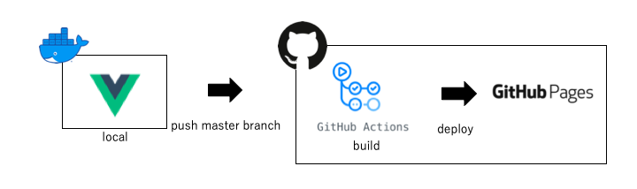

# my_page 

## About
takahiro's portfolio site  
https://taka011002.github.io/my_page/

## How to run

### docker-compose 
```bash
$ docker-compose build
$ docker-compose up -d
$ docker-compose exec app sh
$ open "http://localhost:8080"
```

### docker
```bash
$ docker build -t taka_my_page .
$ docker run -v `pwd`:/usr/src -p 8080:8080 --name my_page --rm -it -d taka_my_page
$ docker exec -it my_page sh
$ open "http://localhost:8080"
```

### local

#### Project setup
```
npm install
```

#### Compiles and hot-reloads for development
```
npm run serve
```

#### Compiles and minifies for production
```
npm run build
```

## Deploy flow
